

<h3 align="center">Back yourself. Keep your money.</h3>

Steppie is an iPhone app that turns a daily walking goal into a commitment backed by your own money. Pick a race, pin your bib, put down a stake and walk. When you finish, every cent comes back. Short races are only a **hold** on your card, so nothing is ever charged if you finish. If you miss, the stake is kept.

**Steppie** is a lion in running shoes who runs your laps with you. The crew around him each own one part of the game.

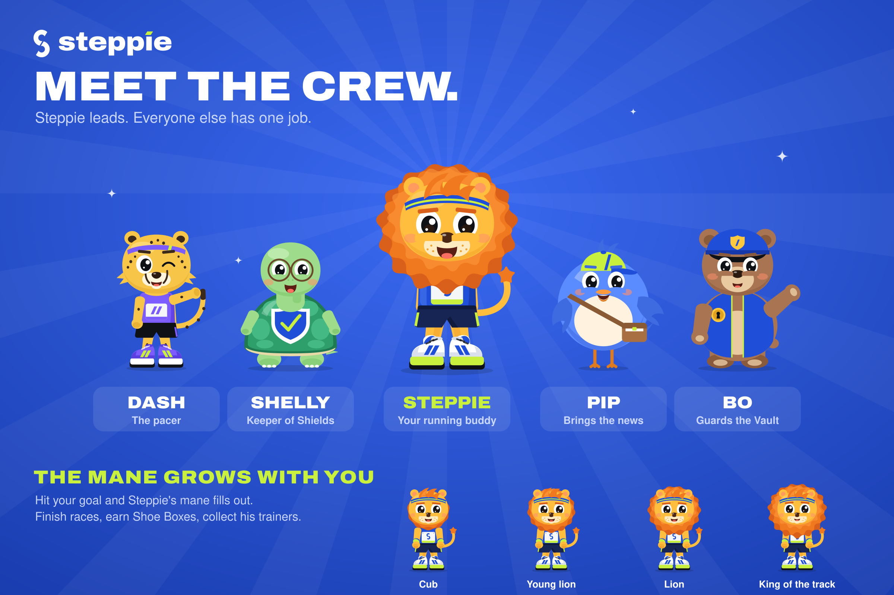

| | Who | Job in the app |
|---|---|---|
| 🦁 | **Steppie** | Runs your laps on the Today track, coaches you, grows his mane with your goal days, wears the trainers you earn. |
| 🐆 | **Dash** | The pacer: a ghost on your track showing where a steady walker would be by now. Hosts the weekly league. |
| 🐢 | **Shelly** | Keeper of Shields. Each Shield covers one missed day; unused ones come back. |
| 🐦 | **Pip** | Brings the news: race invites before you've staked, and your shadow week. |
| 🐻 | **Bo** | Guards the Vault: every hold, charge, release and refund. |

## The app

  
  
  
  

  
  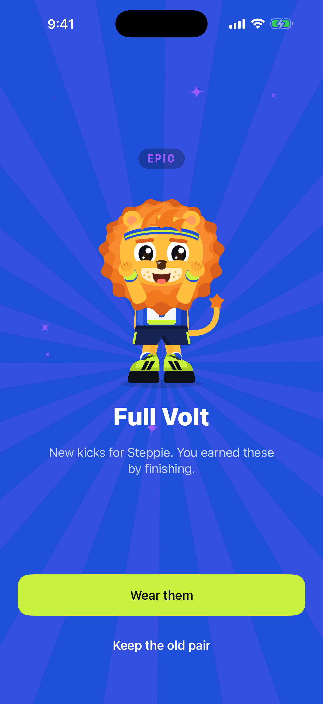
  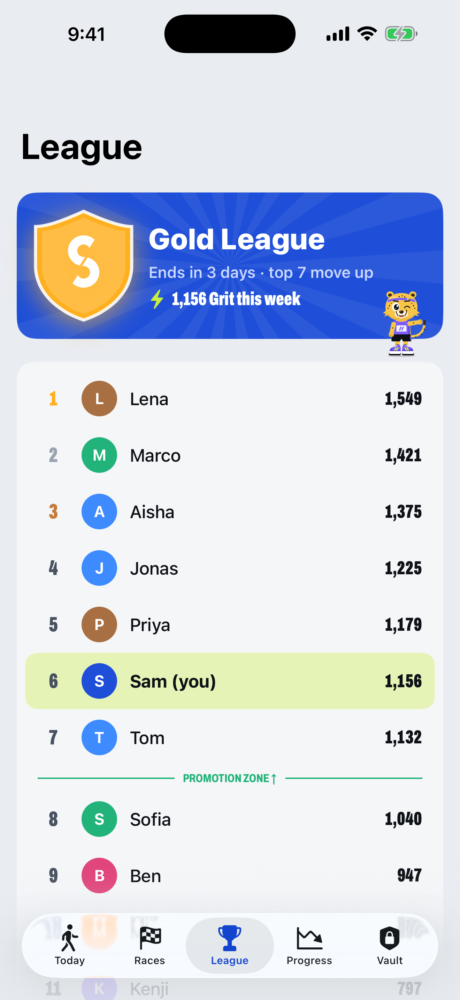
  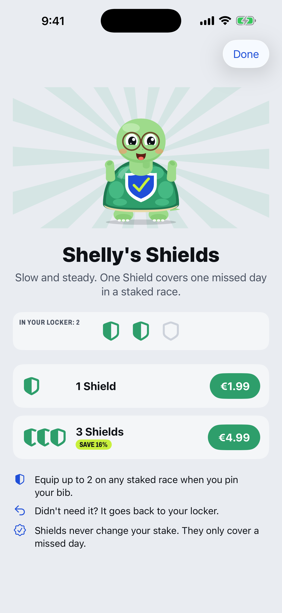

  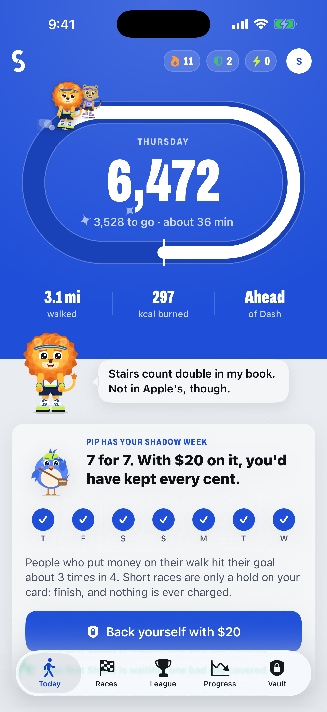
  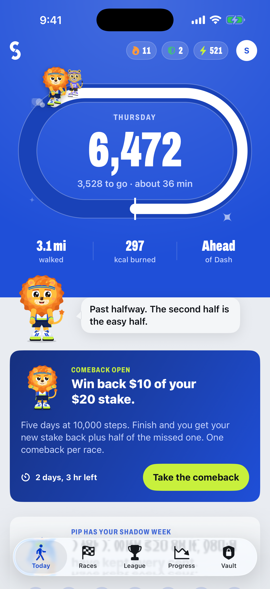
  
  

 <em>The signature interaction: hold to pin your bib.</em>

These are real iOS Simulator captures (iPhone 6.9") taken by CI in demo mode. The data is synthetic. Dark mode versions are in [`screenshots/dark`](screenshots/dark).

### App Store screenshots

  
  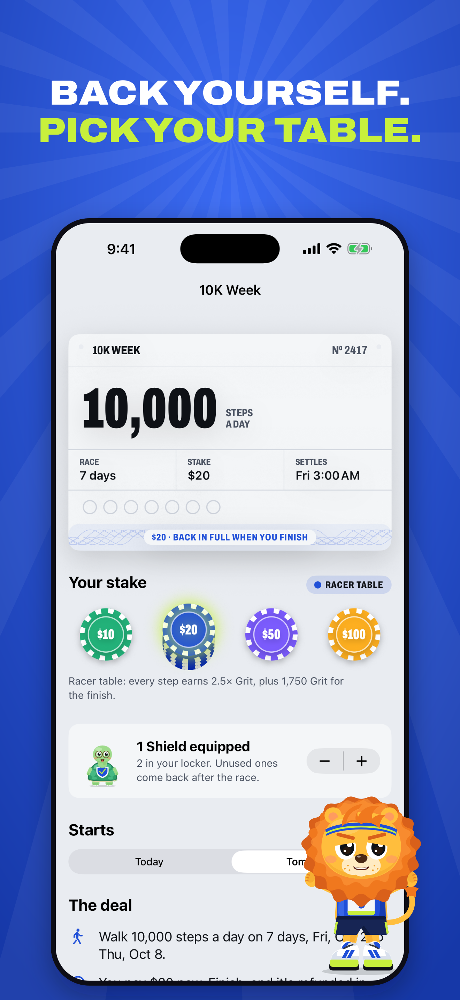
  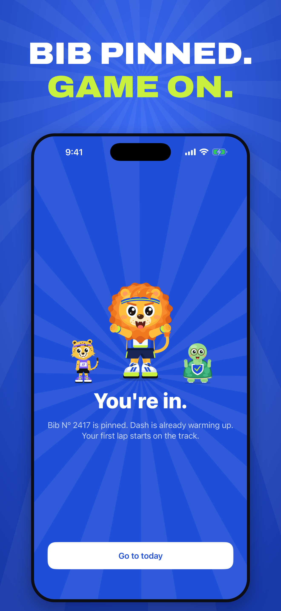
  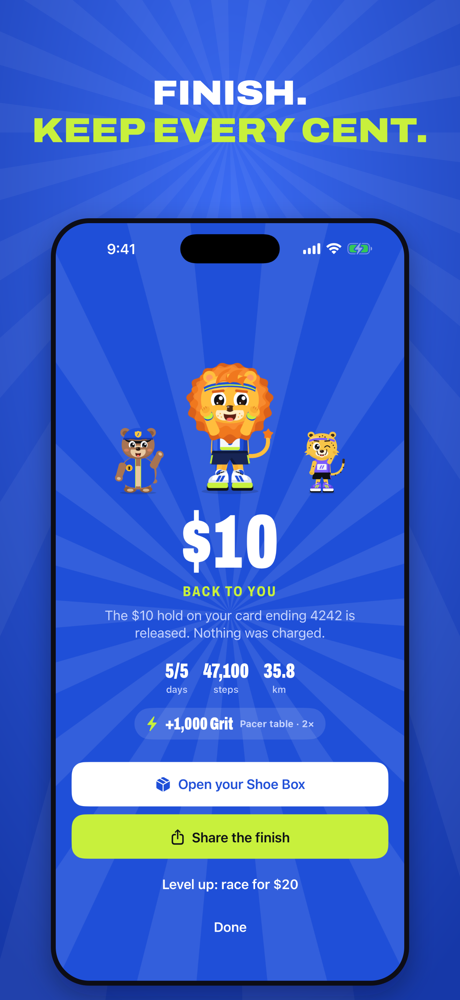
  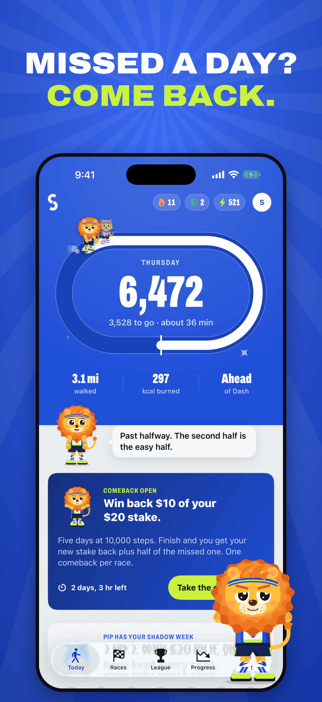
  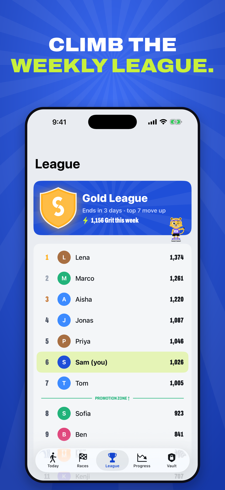

## How it makes money

From stakes on missed races, Shields and Steppie Pro. The business grows by getting more people to back themselves, with bigger stakes, more often. It never works by making people fail. The playbook, with the research behind every lever and the unit economics, is in [`docs/STRATEGY.md`](docs/STRATEGY.md).

| Lever | What it is |
|---|---|
| **Starter Kit** | Onboarding ends with the first pin already in your bib and a free Shield (endowed progress). |
| **Shadow week** | Before you stake, Pip shows your real last 7 days as if money had been on them. |
| **Race invites** | Opt-in, before a stake only: fresh starts, comebacks, Shields waiting. Quiet once money is down: one pace check if you're behind. |
| **Stake tables** | Rookie €5 to Legend €100. Bigger stake, more Grit. Top tables open after finished races. |
| **Stake ladder** | Finish, and the next race suggests one rung up. Miss, and it suggests the same. |
| **Weekly leagues** | Grit from race days. Top 7 move up every Sunday. |
| **Shields** | €1.99 (3 for €4.99). Up to 2 per race. Unused ones come back. |
| **Comeback** | Within 72 h of a miss: finish a 5-day Comeback and get half the missed stake back. Once per miss. |
| **Shoe Boxes** | Every finish: a random pair of trainers for Steppie. Cosmetic, odds by race length, never sold. |

Whether money comes back depends only on steps. There's no chance element anywhere near money, which is what keeps Steppie a commitment contract, not a bet.

## Brand

The **Stride S**: an S cut in two by a forward stride, every cut on the same 58° angle. One colour, works at 16 px, generated from geometry (`brand/tools/stride.py`). Full guide: [`brand/BRAND.md`](brand/BRAND.md).

## Repo map

- `ios/`: SwiftUI app (iOS 17+), widget, and fastlane. The project is generated by XcodeGen (`cd ios && xcodegen generate`).
- `supabase/`: Postgres schema with RLS, plus Edge Functions: `create-stake`, `stripe-webhook`, `submit-steps`, `settle` (cron), `grant-shields`, `public-stats`, `delete-account`. Leagues are SQL (`league_board()`, `roll_leagues()`).
- `brand/`: the Stride S, wordmark, icons, Steppie fonts, and the cast (`brand/mascot/`: geometry source, renders, bible).
- `marketing/`: weekly stats post for X and Discord (live numbers only) and the App Store frame generator.
- `site/`: landing page, privacy, support and race rules.
- `docs/`: strategy and money playbook, research, the prompt audit, and the shipping guide.

## Run it

- **On a Mac:** `brew install xcodegen && cd ios && xcodegen generate && open Steppie.xcodeproj`. Add the launch arguments `-demo YES` to see it with sample data, and `-screen <name>` to jump to a scene (see `DemoRouter` in `SteppieApp.swift`).
- **CI:** every push to `ios/` builds on a macOS runner and captures screenshots.
- **Ship:** follow [`docs/SHIPPING.md`](docs/SHIPPING.md) (Apple, Stripe, Supabase, App Store Server API and GitHub secrets), then run the **Release** workflow.
