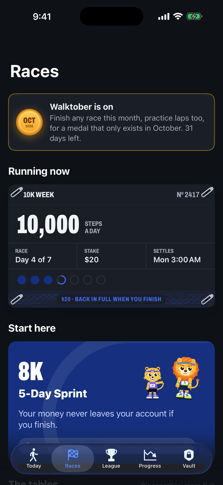
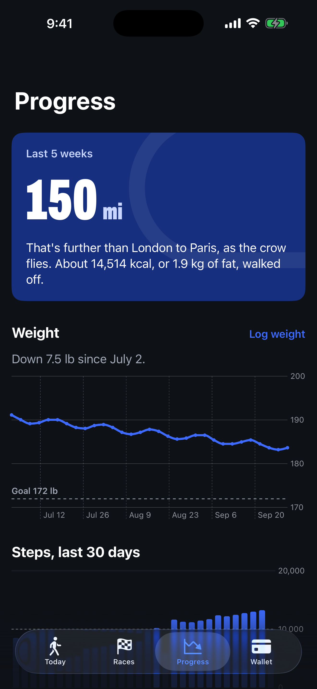
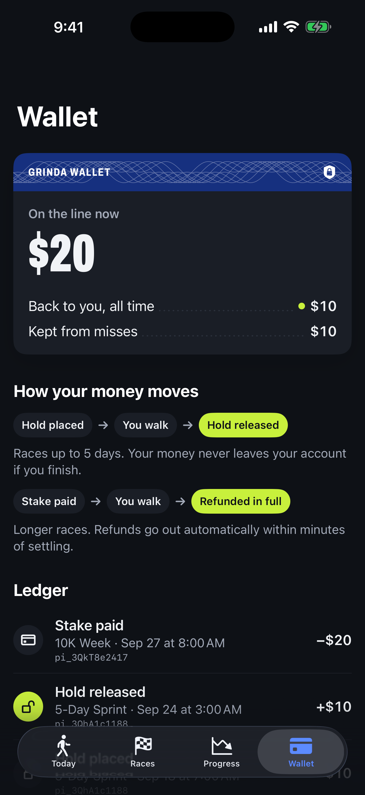

<h3 align="center">Walk it off. Keep your money.</h3>

Grinda is an iPhone app that turns a daily walking goal into a commitment backed by your own money. You pin a race bib, stake an amount, and walk. When you finish, every cent comes back. Short races are only a **hold** on your card, so nothing is ever charged if you finish. If you miss, the stake is kept.

It's built to help people lose weight by walking. The stake is the mechanism, not the point.

  
  
  
  

  
  
  
  

  
  
  
  

 <em>The signature interaction: hold to pin your bib.</em>

Screenshots are real iOS Simulator captures (iPhone, 6.9") taken by CI in demo mode. The data is synthetic.

## What's in the box

| | |
|---|---|
| **Today** | Your steps as laps on a stadium track, with a ghost pacer, minutes-of-walking to go, and kcal. |
| **Races** | A board of races (5-Day Sprint, 10K Week, Weekend Warrior, 30-Day Reset, free Practice Lap). Each race is a numbered bib. |
| **Commit** | The whole deal in plain words, then **hold to pin your bib**: four pins, four haptic taps, then Apple Pay via Stripe. |
| **Progress** | Distance told as a journey, the weight trend against your goal, 30-day steps, and a punch card. |
| **Wallet** | A passbook of every hold, charge, release, and refund with its Stripe reference, plus Grinda's own public books. |
| **Finish** | The tape breaks, and your stake counts back up. Share card for X and Discord. |
| **Also** | Home and Lock Screen widgets, evening pace nudge (max one), Grinda Pro (StoreKit 2), account deletion, EN/DE listing. |

## Repo map

- `ios/`: SwiftUI app (iOS 17+), widget, and fastlane. The project is generated by XcodeGen (`cd ios && xcodegen generate`).
- `supabase/`: Postgres schema with RLS, plus Edge Functions: `create-stake`, `stripe-webhook`, `submit-steps`, `settle` (cron), `public-stats`, `delete-account`.
- `site/`: the landing page, privacy, support, and race rules, at https://cipherdriftx.github.io/grinda/
- `marketing/`: the weekly stats post for X and Discord, built from live numbers only.
- `brand/`: name, G-Track symbol, wordmark, app icons, fonts, and the brand guide.
- `docs/`: research, strategy (hooks, trust, economics, growth), the prompt audit, and the **shipping guide**.
- `PRODUCT.md` and `DESIGN.md`: the product record and the design system.

## Run it

- **On a Mac:** `brew install xcodegen && cd ios && xcodegen generate && open Grinda.xcodeproj`. Add the launch arguments `-demo YES` to see it with sample data.
- **CI:** every push to `ios/` builds on a macOS runner and captures screenshots.
- **Ship:** follow [`docs/SHIPPING.md`](docs/SHIPPING.md) (Apple, Stripe, Supabase, and GitHub secrets), then run the **Release** workflow.
