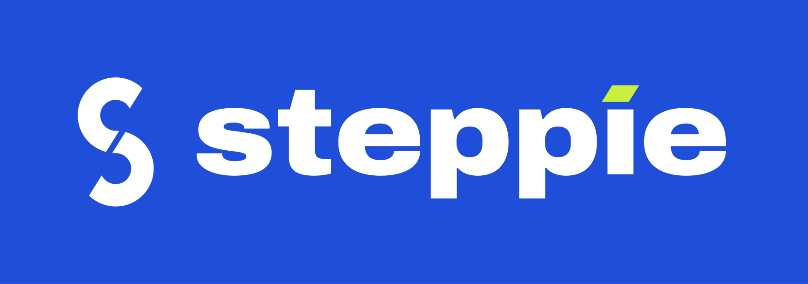

# Steppie brand

## Name

**Steppie.** Two syllables, stress on the first (GRIN-da), ending in an open vowel like Tesla, Honda, Nokia, and Mazda. It reads the same in English and German, is easy to say after hearing it once, and carries a clear meaning: *the grind*, daily effort that adds up. The first syllable is a smile ("grin"). There's no generic descriptor in it (Step-, Walk-, Fit-), so the brand can grow beyond steps.

## The mark: G-Track

The symbol is one thick stroke drawn as a **running track seen from above**: two straights and two bends. It opens at the upper right like a **G**, and the crossbar of the G is the **finish line**.

- **One idea, two reads.** Track and G, the same way the FedEx arrow is both negative space and direction.
- **Geometric construction.** Built entirely from two semicircles, two straights, and a bar, all at one stroke width (150 u on a 870 × 570 u box: straights 300 u, bend radius 210 u, opening 42°, bar 190 u). Generator: `tools/final.py`.
- **Reducible.** Works in one flat colour, reversed, at 1024 px and at 16 px. No gradients, shadows, or effects in the master.
- **Distinctive.** The circular G (Google) was tested and rejected. The stadium proportion is owned.

### Rand/Haviv test

| Test | How G-Track answers it |
|---|---|
| Appropriate | A running track: effort, laps, a finish line to reach. |
| Distinctive | Stadium proportion; no competitor in fitness or fintech uses it. |
| Simple | One stroke, one colour, drawable from memory. |
| Memorable | "The G that's a running track." |
| Timeless | Pure geometry, no trend effects. |
| Scalable | Legible at 29 px (the smallest iOS icon) and on a billboard. |

## Wordmark

`STEPPIE` in **Steppie Wide Black** (Archivo, instanced at width 125 and weight 900, SIL OFL 1.1), tracked +4%, converted to outlines. Wide, heavy capitals read as institutional and trustworthy: the register of VISA, SONY, and FedEx rather than a startup's rounded lowercase.

Lockup: symbol height = 1; wordmark cap height = 0.46; gap = 0.34. Clear space on every side = the bar length.

## Colour

| Role | Name | Hex | Use |
|---|---|---|---|
| Brand field | **Lane Cobalt** | `#1F4FD8` | The track. App icon, Today field, primary actions. White text on it reaches 6.6:1. |
| Paper | **Tyvek** | `#F4F6F8` | Race-bib cards, light-mode ground. |
| Ink | **Ink** | `#0E1116` | Text, dark-mode ground. |
| Signal | **Finish Volt** | `#C8F03C` | Only for completion and money returned. Never decoration. |
| Alert | System red | — | Only for "stake at risk". |

Dark mode: a floodlit track. Ink ground, cobalt lifted to `#3D6BFF` (4.3:1 on ink, so large text and controls only), and lane lines at white 12%.

## Type

- **UI:** SF Pro (system), Dynamic Type everywhere.
- **Bib numerals & labels:** Steppie Bib Black (Archivo width 62, weight 900) and Steppie Bib Bold (width 75, weight 750). Tabular figures available.
- **Wordmark / rare display:** Steppie Wide Black.

## Voice

A coach who is on your side. Short, warm, specific. It talks about steps, minutes, and your body. Money is stated plainly, only where money moves.

- Yes: "4,120 to go. About 38 minutes of walking."
- Yes: "€20 back on your card. You earned that."
- No: "Don't lose your money!!!" No shaming, no fake urgency.

## App icon

`icon/appicon-1024.png` (default, cobalt with a gentle vertical light), `icon/appicon-dark-1024.png` (iOS dark appearance), and `icon/appicon-tinted-1024.png` (iOS tinted appearance, grayscale).
